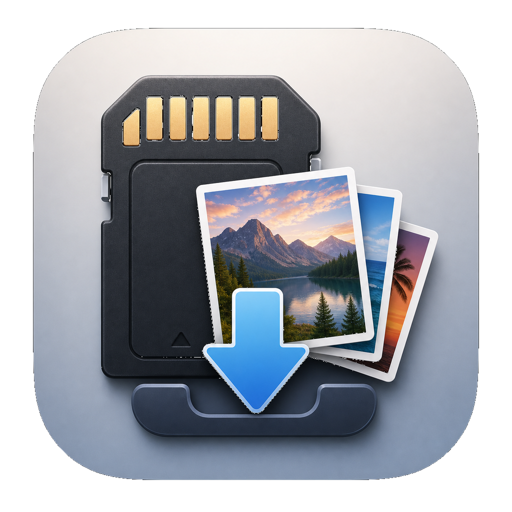

# CardImporter

<p align="center">
  
</p>

A small macOS SwiftUI importer for SD cards and camera folders.


## What It Does

- Lists mounted volumes and lets you choose a source folder manually.
- Lets you choose any destination folder or external drive.
- Scans photos, raw files, and videos into a selectable preview grid.
- Generates thumbnails with Quick Look.
- Copies selected media directly into the chosen destination folder.
- Verifies each copied file with a sampled first/middle/last fingerprint before recording it as imported.
- Stores a global SQLite import ledger at `~/Library/Application Support/CardImporter/imports.sqlite`.
- Can index existing destination media so previous manual copies are recognized later.

The sampled fingerprint reads up to 256 KB from the beginning, middle, and end
of each file, plus the byte count. This keeps duplicate detection fast while
still catching most wrong-file, truncated-copy, and partial-copy cases.

## Run

```bash
./script/build_and_run.sh
```

Optional modes:

```bash
./script/build_and_run.sh --verify
./script/build_and_run.sh --logs
./script/build_and_run.sh --debug
```
